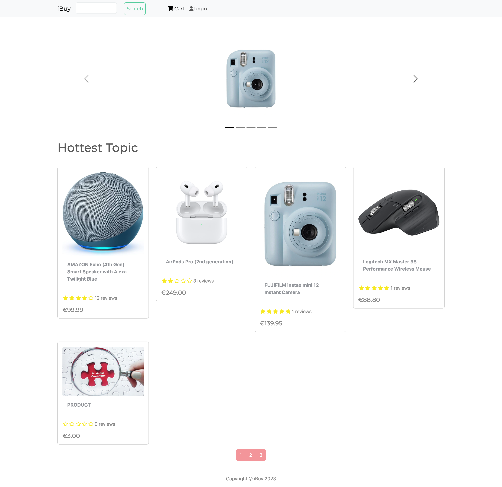

# iBuy Ecommerce Website With Django + React + PostgreSQL

# Features
* Full featured shopping cart
* Product reviews and ratings
* Top products carousel
* Product pagination
* Product search feature
* User profile with orders
* Admin product management
* Admin user management
* Admin Order details page
* Mark orders as delivered option
* Checkout process (shipping, payment method, etc)
* PayPal / credit card integration

### Download & Setup Instructions

* 1 - Clone project: git clone https://github.com/vs44144/iBuy.git
* 2 - cd backend

### Setup environment
##### Create environment
- Linux, macOS: `python3 -m venv .env/`
- Windows: `python -m venv .env/`
##### Activate environment
- Linux, macOS: `source .env/bin/activate`
- Windows: `.env\Scripts\activate`
* 5 - pip install -r requirements.txt
* 6 - python manage.py runserver

# Install react modules
* 1 - cd frontend
* 2 - npm install